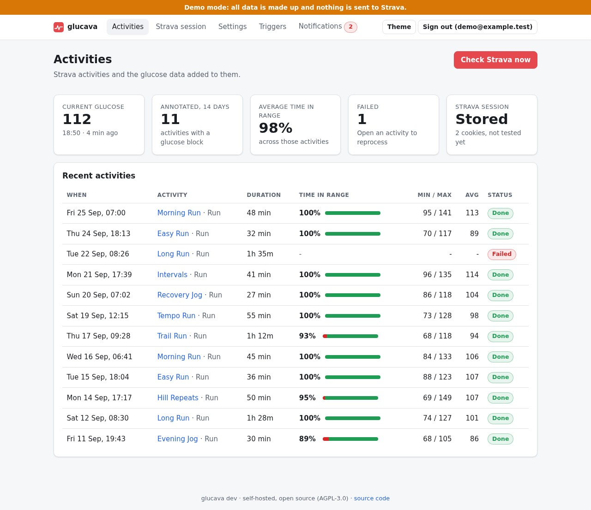
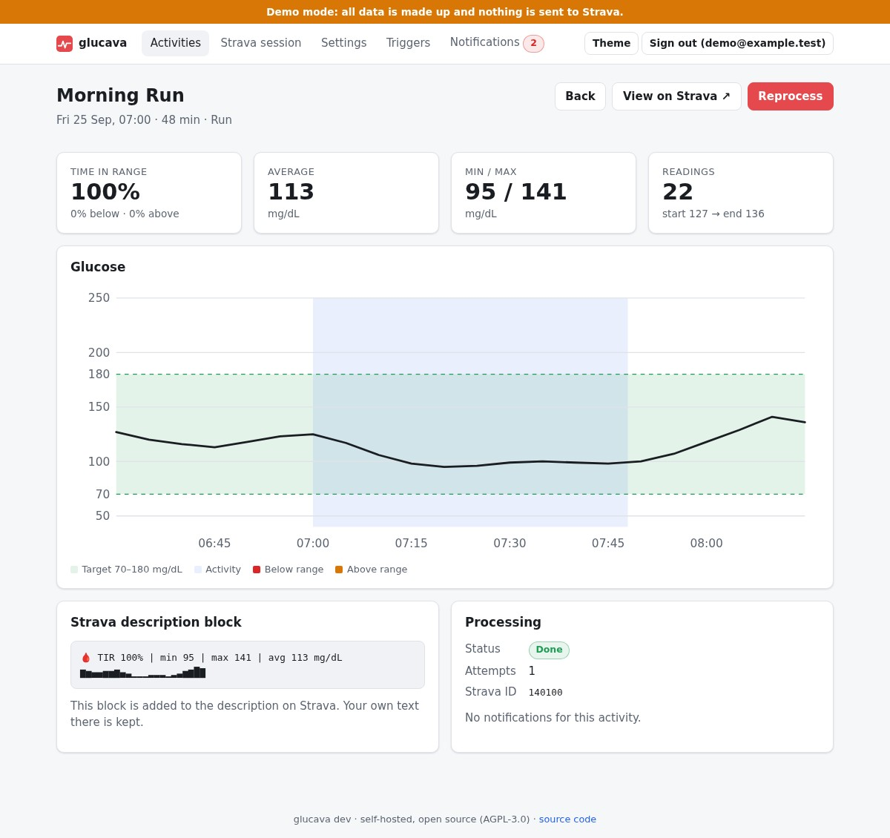
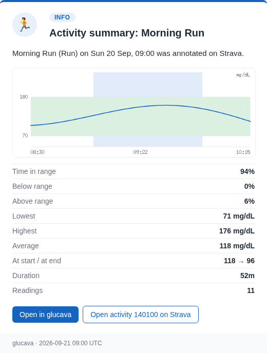
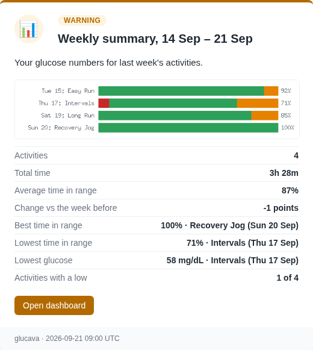
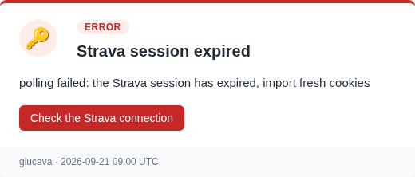

# Glucava

[](https://github.com/MrCodeEU/glucava/actions/workflows/ci.yml)
[](LICENSE)

Free and self-hosted. After a Strava activity ends, Glucava adds your Dexcom glucose stats (time in range, min, max, average, sparkline) to its description:

```
🩸 TIR 92% | min 78 | max 164 | avg 112 mg/dL
▁▂▃▃▄▅▄▃▃▂▂▃
```

Strava's API is paywalled, so Glucava edits the description through a headless Chrome session with your own cookies. One Go binary (PocketBase + web UI); Chrome/Chromium must be installed.

> **Not a medical device.** Glucava copies numbers from your CGM into a Strava description for your own reference. It does not measure, diagnose, alarm or advise, and it must never be used for treatment decisions or as a replacement for your CGM app's alarms. It can be wrong, late or silent (a source can be down, a timestamp off, Strava's page can change). Use at your own risk; see the warranty disclaimer in the [license](LICENSE).
>
> Glucava is an independent project. It is not affiliated with or endorsed by Strava, Dexcom, Abbott, Glooko or Nightscout; those names belong to their owners. Automating Strava's web UI may breach Strava's terms of service (see [SECURITY.md](SECURITY.md)); the session is your own and the volume is low, but the risk is yours.

## Screenshots

All from demo mode (`make mock`), so the data is made up. The UI follows your light or dark preference.

<p>
<picture><source media="(prefers-color-scheme: dark)" srcset="docs/img/ui-dashboard-dark.png"></picture>
<picture><source media="(prefers-color-scheme: dark)" srcset="docs/img/ui-activity-dark.png"></picture>
</p>

Notification emails (HTML with a plain-text fallback, inline charts drawn by glucava):

<p>



</p>

## Quick start

```sh
make mock          # fake Strava + Dexcom data, http://127.0.0.1:8090 (make help lists all targets)
```

Real use, with Docker:

```sh
docker build -t glucava .
docker run -d --name glucava -p 127.0.0.1:8090:8090 -v glucava:/data \
  -e GLUCAVA_ADMIN_EMAIL=you@example.com \
  -e GLUCAVA_ADMIN_PASSWORD='long-random-password' \
  -e GLUCAVA_SECRET_KEY="$(openssl rand -base64 32)" glucava
```

Put a TLS reverse proxy in front. Then:

1. Sign in, open **Settings**, enter Dexcom Share credentials (or `glucava dexcom set <user> --region us|ous|jp`). Enable Share in the Dexcom app. "Test connection" checks the login.
2. Open **Strava**. Paste your strava.com cookie export (or `glucava strava cookies import file.json`); this is the supported path. "Sign in automatically" is an **experimental** alternative that fills Strava's login form for you and stores the resulting cookies; it gives up at the first CAPTCHA, verification code or wrong-password message rather than guess, and never stores the password. It has not been verified against the real Strava login page.
3. Run `glucava strava check` to verify the session and edit-page selectors without saving.

## Usage

- **Polling:** Settings → poll interval. New activities from the last 24 h are processed once.
- **Push trigger:** create a token on the **Tokens** page (shown once), then call it from Tasker or Apple Shortcuts when the Strava notification arrives:
  `curl -X POST -H "Authorization: Bearer gst_..." https://host/api/trigger`
  See [docs/triggers.md](docs/triggers.md) for Tasker, HTTP Shortcuts/MacroDroid, and Apple Shortcuts setup.
- **Manual:** open an activity for a preview, then Process or Reprocess. Existing text is kept; only the 🩸 block is replaced.
- **By id:** the **Strava session** page has a "Process a specific activity" field for an activity the poller never saw at all (e.g. it predates glucava, or is older than the polling window). It pages through your Strava training log looking for that id, same as Reprocess otherwise.
- **Notifications:** ntfy, webhook (HMAC-signed) or email on failures and expired sessions. Email is set up under Settings → Email (SMTP host, credentials, recipient); `GLUCAVA_SMTP_*` (below) can seed it on first start. Emails are HTML cards with an icon, a plain-text fallback, an inline glucose chart in the activity summary and a time-in-range bar chart in the weekly one (drawn by glucava itself, embedded in the mail, nothing loaded from the internet), and link back to the right page of the web UI when a public URL is set. Two optional summaries, both off by default and email-only: a summary after each processed activity and a weekly summary (Monday, 08:00 in the server's time zone (set `TZ` in a container), for the week before).
- **Chart photo (experimental, off by default):** with `chart_image` on, glucava also attaches the glucose chart to the activity as a photo, once per activity (a reprocess never adds a second one, and glucava cannot delete photos). It drives Strava's edit page like the description write, so it depends on the photo file input there: `glucava strava inspect <id>` reports whether the input is found, and it is a "no photo control" failure alert if not. Note that Strava may use a first photo as the activity's cover instead of the map. The look (theme, size, shaded ranges, dots, line thickness) is set under Settings, with a live preview that updates as you change the options; with the option on, each activity page also shows the exact image.
- **Glucose gap alert:** when no glucose reading has been stored for 3 hours (setting `gap_alert_hours`, 0 turns it off) glucava raises one alert per gap, through the usual channels. It catches a stopped sensor share or a broken Dexcom login, and does not try to replace the sensor app's own low/high alarms.
- **Canary:** once a day, glucava dry-runs the edit page against your most recent activity (no save) to catch a broken selector or an expired session before it silently fails a real one; a failure notifies like any other event.
- Dexcom Share itself only serves ~24 h of history, but a background job stores every reading it sees into glucava's own database as it arrives, so an activity can still be reprocessed later as long as its window is within Settings → **Your data** → retention (default 365 days). An activity missed entirely while it was still fresh (e.g. glucava was not running, or the reading never got ingested) cannot be recovered after the fact — unless you can still get that period as an export file: `make glucose-import FILE=export.csv FORMAT=libre` backfills readings from another app's export directly into the same database, so an older activity can be reprocessed against them. `glucava glucose import --format` currently understands `glooko` (a Glooko export — either the zip download directly, or `cgm_data_*.csv` from its extracted folder; verified against a real export), `libre` (a LibreView CSV export; unverified against a real file — see the code comment) and `nightscout` (an `entries.json` export). A zip is decoded entirely in memory and never extracted to disk: the entry name is only ever compared as a string, never used to build a filesystem path, so a malicious entry name cannot write outside the intended location; decompression is capped to bound a zip bomb. Adding another format is one function; see the extension point below.

## Configuration

| Variable | Meaning |
|---|---|
| `GLUCAVA_ADMIN_EMAIL`, `GLUCAVA_ADMIN_PASSWORD` | first user, created on start |
| `GLUCAVA_DEXCOM_USERNAME`, `GLUCAVA_DEXCOM_PASSWORD`, `GLUCAVA_DEXCOM_REGION` | Dexcom Share login, stored on first start if no credential is stored yet (alternative to `make dexcom`); safe to remove afterwards |
| `GLUCAVA_RETENTION_DAYS` | readings/events retention in days (0 = forever); overrides the UI setting on every start, not just the first |
| `GLUCAVA_PUBLIC_URL` | address of the web UI, e.g. `https://glucava.example.com`; used for links in emails. Seeds the **Public URL** setting while none is saved |
| `GLUCAVA_SMTP_HOST`, `GLUCAVA_SMTP_SENDER_ADDRESS` | seed the SMTP settings on first start (only while none are saved; afterwards edit them in Settings → Email) |
| `GLUCAVA_SMTP_PORT` (default `587`), `GLUCAVA_SMTP_USERNAME`, `GLUCAVA_SMTP_PASSWORD`, `GLUCAVA_SMTP_TLS=1`, `GLUCAVA_SMTP_SENDER_NAME` (default `glucava`), `GLUCAVA_SMTP_TO` | rest of the seed; `TO` is the recipient. The password goes into the encrypted vault, and is stored later too if you add it after the first start |
| `GLUCAVA_SECRET_KEY` | encryption key for stored secrets (default: `<data dir>/secret.key`) |
| `GLUCAVA_TRUSTED_PROXIES` | comma-separated IPs/CIDRs of your reverse proxy. Only then are `X-Forwarded-For`/`-Proto` believed (per-client rate limits, Secure cookie). Unset = direct peer only |
| `GLUCAVA_SOURCE` | live glucose source (default and currently only: `dexcom`); an unknown name stops the server at start |
| `GLUCAVA_CANARY_INTERVAL` | how often the edit-page canary runs, e.g. `12h`; `off` disables it (default `24h`) |
| `GLUCAVA_POLL_LOOKBACK` | how old an activity may be and still be picked up by polling (default `24h`) |
| `GLUCAVA_RETRY_BACKOFF` | waits before each retry of a failed job, comma-separated (default `1m,3m,10m`) |
| `GLUCAVA_NOTIFY_COOLDOWN`, `GLUCAVA_NOTIFY_MAX_AGE` | one notification per event and activity per cooldown (default `6h`); undeliverable events older than max age are dropped (default `24h`) |
| `GLUCAVA_STRAVA_SELECTOR_DESCRIPTION`, `GLUCAVA_STRAVA_SELECTOR_SAVE` | JSON array of CSS selectors for Strava's edit page, tried **before** the built-in ones, so a Strava markup change is a config fix, not a release. Check with `glucava strava check` |
| `GLUCAVA_USER_AGENT` | browser user agent for the Strava session (default built in) |
| `GLUCAVA_ADMIN_UI=1` | expose PocketBase admin UI and API (off by default) |
| `GLUCAVA_NO_SANDBOX=1` | Chrome `--no-sandbox` (set in the Docker image) |
| `CHROME_PATH` | Chrome binary |

## Email notifications (Gmail example)

Glucava sends through any SMTP server; Gmail works well for a personal setup.

1. Turn on 2-Step Verification for the Google account.
2. Create an app password at <https://myaccount.google.com/apppasswords> (16 characters; your normal password is rejected). Type it without spaces.
3. Either fill in **Settings → Email**, or seed it from `.env` before the first start:

   ```sh
   GLUCAVA_SMTP_HOST=smtp.gmail.com
   GLUCAVA_SMTP_PORT=587
   GLUCAVA_SMTP_TLS=0            # 587 uses StartTLS; for port 465 set GLUCAVA_SMTP_TLS=1
   GLUCAVA_SMTP_USERNAME=you@gmail.com
   GLUCAVA_SMTP_PASSWORD=your-16-char-app-password
   GLUCAVA_SMTP_SENDER_ADDRESS=you@gmail.com   # must be the Gmail address (or one of its aliases)
   GLUCAVA_SMTP_TO=you@gmail.com
   ```

4. Press **Send test notification** on the Settings page.
5. Under **What to email**, choose the kinds you want:
   - **Failure alerts** (on by default): expired session, failed update, missing glucose data, canary failure, rejected trigger.
   - **Summary after each activity** (off): one mail per newly processed activity with time in range, lows and highs, average, start and end values. A reprocess from the UI does not send another.
   - **Weekly summary** (off): Monday from 08:00 server time, covering Monday to Sunday of the week before: activities, total time, average time in range, change against the week before, best and lowest activity, lowest glucose and how many activities had a low. A week without processed activities sends a short "no activities" note instead, so silence is never ambiguous. If glucava was down on Monday it sends when it is back that week.
   - **Monthly health report** (off): on the 1st from 08:00, for the month before: activities annotated and failed, glucose data coverage (share of hours with at least one reading), latest annotated activity, alerts of the month and the glucava version. It also works as a heartbeat: if it stops arriving, glucava is down.
6. Set **Public URL** (or `GLUCAVA_PUBLIC_URL`) to add "Open in glucava" buttons that point at the activity, the Strava page, the tokens page or the dashboard. Without it, mails contain no links to the web UI (the Strava activity link is always there).

Summaries are email-only; ntfy and webhooks keep receiving alerts only. Scripted: `glucava config set mail_weekly true` (keys `mail_alerts`, `mail_activity`, `mail_weekly`, `public_url`).

The variables only seed the settings while no SMTP host is saved yet; after that the web UI is the source of truth and later edits in `.env` are ignored (except a password added while none is stored). Glucava does not expose the SMTP auth method or EHLO name, so servers that need LOGIN auth or a custom EHLO name (e.g. Gmail SMTP-relay) are not supported.

## Scripted setup (Ansible, cloud-init, ...)

Everything the web UI can change is scriptable, with the same validation:

```sh
# settings: key=value lines, comments allowed; idempotent (prints "unchanged" on a re-run)
glucava config apply settings.conf --dev=false --dir /data
glucava config set unit=mmol/L poll_interval_minutes=5 --dev=false --dir /data
glucava config list --dev=false --dir /data        # all keys with current values
glucava config get smtp_host --dev=false --dir /data

# secrets: the value is read from stdin, never from argv
printf '%s\n' "$SMTP_APP_PASSWORD" | glucava secrets set smtp_password --dev=false --dir /data
glucava secrets status --dev=false --dir /data     # set/unset per secret, never the values
```

- The keys are `unit`, `range_low`, `range_high`, `pre_minutes`, `post_minutes`, `poll_interval_minutes`, `retention_days`, `dexcom_region`, `dexcom_username`, `ntfy_url`, `webhook_url`, `email_to`, `smtp_host`, `smtp_port`, `smtp_username`, `smtp_tls`, `smtp_sender_address`, `smtp_sender_name`, `public_url`, `mail_alerts`, `mail_activity`, `mail_weekly`, `mail_health`, `gap_alert_hours`, `chart_image`, `chart_theme`, `chart_size`, `chart_band`, `chart_activity`, `chart_dots`, `chart_line` (`glucava config list` is authoritative).
- Settings you pass in one call are validated together, so related keys (`smtp_host` with `smtp_sender_address`) can come in any order. An invalid batch changes nothing and exits non-zero.
- Secrets: `dexcom_password`, `ntfy_token`, `webhook_secret`, `smtp_password`. Strava cookies: `glucava strava cookies import`. Trigger tokens: `glucava token create <name>`.
- `GLUCAVA_RETENTION_DAYS`, when set, still overrides `retention_days` at every server start.
- The commands work whether or not the server runs. Pass `--dev=false` for quiet output; results go to stdout, errors to stderr.

## Maintenance

- `glucava user set-password <email>` reads the new password (12+ characters) from stdin and signs out every session. Logout also invalidates the session server-side. Logins last 3 days.
- `glucava secrets rotate-key` re-encrypts stored secrets with a fresh key. Stop the server and back up the data dir first.
- Settings → **Your data**: retention (default 365 days for readings and events; 0 keeps them), CSV export of readings and activities, and delete-all. `glucava data purge --yes` does the same from the shell. Activities are kept by retention because they log what was written to Strava.
- Only one user account can exist.
- Back up the data dir and the encryption key separately; a backup holding both exposes your credentials. See [Backup and restore](#backup-and-restore).

## Backup and restore

All state is in the data dir (`/data` in Docker): the SQLite database (settings, activities, readings, events, encrypted secrets) and, unless you set `GLUCAVA_SECRET_KEY`, `secret.key`.

- **Back up** with the server stopped, or from a filesystem snapshot: copy the data dir. Keep the encryption key somewhere else (`GLUCAVA_SECRET_KEY` in your secret store, or `secret.key` copied separately). Data without the key cannot be decrypted, and the key without the data is useless, which is the point.
- **Restore:** put the data dir back, provide the same key, start the same or a newer version. Migrations run on start.
- **Upgrades** only move forward: migrations have no down steps. To go back to an older version, restore a backup taken before the upgrade.
- **Lost key:** stored secrets are unrecoverable. Start with a new key, then enter them again (`glucava secrets set ...`, `glucava strava cookies import`). Settings and history are not affected.
- **Rehearse it** once: restore a copy into a temp dir and run `glucava config list --dev=false --dir <copy>` and `glucava secrets status --dev=false --dir <copy>` with the key.

## Development

Run `make hooks` once to enable the git hooks (pre-commit: gofmt, vet, lint; pre-push: tests, govulncheck). `make check` runs everything CI runs. See [docs/DEVELOPMENT.md](docs/DEVELOPMENT.md). See [SECURITY.md](SECURITY.md) for the threat model. Automating Strava's web UI may breach its terms; use at your own risk.

**Adding a glucose source.** Dexcom Share (`internal/glucose/dexcom.go`) is the only built-in source, but the pipeline (background ingestion, activity processing, live dashboard reading) only depends on the small `glucose.Source` interface:

```go
type Source interface {
    Samples(ctx context.Context, from, to time.Time) ([]stats.Sample, error)
}
```

A Libre, Tandem or Medtronic **live API** source is a new type implementing that one method, plus one entry in `sourceBuilders` (`cmd/glucava/wire.go`); users then select it with `GLUCAVA_SOURCE`. No changes needed elsewhere.

**Adding a file importer** (a one-shot export, not a live API) is a separate, smaller interface in `internal/glucose/importers`:

```go
type Importer interface {
    Parse(r io.Reader) (samples []stats.Sample, skipped int, err error)
}
```

Register it by name in an `init()` func (see `libre.go`) and it is immediately available to `glucava glucose import --format <name>`; no other wiring needed.

Either kind of contributed source, for hardware or an account type the maintainer doesn't have, is welcome but untested by CI; say so plainly in the code and docs, the same way the experimental Strava auto-login and the Libre importer are marked.

## Contributing, security, license

- Contributions are welcome: read [CONTRIBUTING.md](CONTRIBUTING.md) first. Please follow the [Code of Conduct](CODE_OF_CONDUCT.md).
- Security problems: report them privately, see [SECURITY.md](SECURITY.md).
- License: [AGPL-3.0](LICENSE), Copyright (C) 2026 Michael Reinegger. If you run a modified version for other people over a network, the AGPL requires you to offer them your source; the web UI's footer links to it (`web.SourceURL`, change it in a fork). Third-party components are listed in [NOTICE.md](NOTICE.md).
